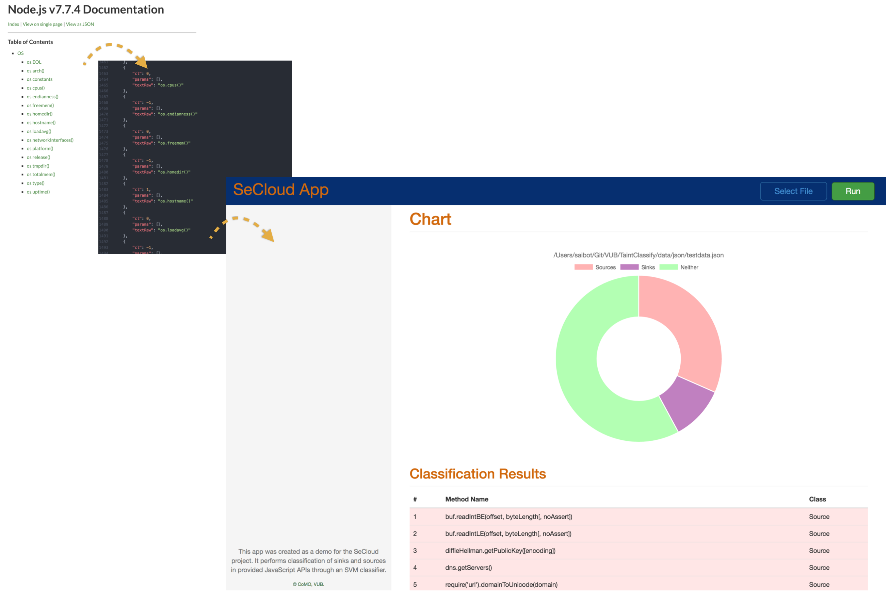

# secloudapp
[SeCloud](http://www.securit-brussels.be/project/secloud/) app for classifying sinks and sources. Developed using the [Electron](https://electron.atom.io/) framework.
The app takes as input a JavaScript api and performs classification on the given methods using an already trained SVM classifier. Results are shown as a doughnut chart and as a list with the associated classes.

## Requires
Electron, node.js be must be installed.

## Data Format
The API to be classified should be a JSON file formatted as follows:
```json
{
    "cl": 0,
    "params": [
        "value",
        "message"
    ],
    "textRaw": "assert(value[, message])"
}
```

## Run 
Running the app is pretty straightforward. Just navigate to the [secloudapp](./) folder and type ```npm start```.
There you can select the file you want to analyze and press Run. The workflow is as shown in the following image.



